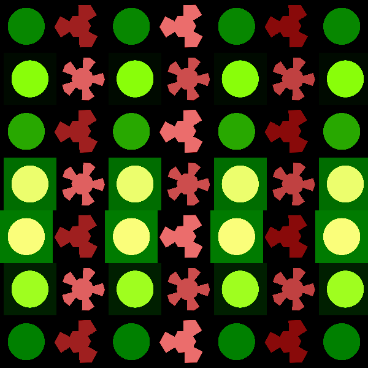

<h1>Dibujo Shader:</h1>

<p>Esta práctica sirve como toma de contacto con la programación de shaders personalizados como alternativa al uso de la secuencia de renderizado predefinida de processing.</p>

<p>Para la resolución de la práctica se ha desarrollado un shader generativo de fragmento. El resultado de la ejecución del shader es una animación más o menos artística, para la cual se han tomado como ejemplo algunos de los scripts vistos en clase.</p>

<h2>Detalles de implementación:</h2>

<p>La animación es una rejilla de 6x6 en las que las filas impares se llenan de un polígono en cada celda y de una circunferencia en cada celda de las filas pares. Los poligonos rotarán a favor y en contra de las agujas del reloj según una función seno. Para que se produzca la rotación se usará una matriz de 2x2 de rotación, la cual se sitúa en el método rotate2D.</p>

<h3>El dibujo de los polígonos:</h3>

<p>Para dibujar los polígonos se hace uso del método poli1. Los polígonos son hexágonos con los lados divididos por su mitad y exendiendo el radio del polígono al doble cada 2pi/NumLados. Los colores de los polígonos se asignarán usando una función que genera valores pseudo-aleatorios y al que se le pasa como semilla un vector vec2 con los valores del índice de columna de la rejilla. El canal rojo tomará el valor devuelto por la función y los canales verde y azul tomarán la parte fraccionaria de la suma y la resta del valor devuelto y del valor 0.5.</p>

```java
vec3 poli1(in vec2 _st, in int N, in vec2 seed){
  float d = 0.;
  
  // Ángulo y radio del píxel actual
  float a = atan(_st.x, _st.y) + PI;
  float r = TWO_PI / float(N);
  
  // Afectamos de forma diferente sectores pares e impares
  if (mod(a/r, 2.) < 1.)
  		d = cos(floor(.5 + a/r) * r - a) * length(_st);
  else
        d = cos(floor(.5 + a/r) * r - a) * length(_st) * 2.;

  float val = random(seed); 
  return vec3(val-smoothstep(.4, .41, d),
             fract(val - .5) - smoothstep(.4, .41, d),
             fract(val + .5) - smoothstep(.4, .41, d));
}
```
<h3>El dibujo de los círculos:</h3>

<p>El dibujo de los círculos se realizará mediante la llamada al método circle que utiliza una técnica basada en el uso de la llamada a la función smoothstep, mediante la cual se evita la utilización de raices cuadradas en el cálculo. Los colores de las celdas de circunferencias se realizarán, como en el caso anterior, llamando a la función generadora de valores pseudo-aleatorios pero esta vez no se ha utilizado la función fract, en la suma  y resta en los canales verde y azul, de modo que se consigue un color que contrasta con los colores de los polígonos.</p>

```java
vec3 circle(in vec2 _st, in float _radius, in vec2 seed){
    vec2 l = _st-vec2(0.5);
    float aux_cir = smoothstep(_radius-(_radius * 0.01),
                         _radius+(_radius * 0.01),
                         dot(l,l) * 4.0);
    float val = random(seed);
    
    return vec3(val - aux_cir, val + .5 - aux_cir, val - .5 - aux_cir);
}
```

<h3>Animación global:</h3>

<p>El efecto central de la animación se produce mediante la traslación de las filas y columnas de la rejilla de modo cíclico. Para realizar esta animación se toman los valores del seno de los segundos transcurridos desde la activación de la aplicación. Cuando el seno devuelve valores negativos, se anima las filas impares hacia la izquierda y de vuelta al centro, mientras que cuando la función devuelve valores positivos, se desplazan las columnas pares en sentido ascendente y de vuelta al centro. La lógica de este efecto se encuentra en el método moveColumnsRows.</p>

```java
void moveColumnsRows(inout vec2 _st){
    float off = sin(u_time);
    if (off > 0.)
    {
        if (floor(mod(_st.y * scale, 2.0)) == 1.)
    		_st.x += off;
    }
    else
    {
        if (floor(mod(_st.x * scale, 2.0)) == 1.)
    		_st.y += off;
    }
}
```

<div align="center">
	<p></p>
</div>

<p>Esta aplicación se ha desarrollado como novena práctica evaluable para la asignatura de "Creando Interfaces de Usuarios" de la mención de Computación del grado de Ingeniería Informática de la Universidad de Las Palmas de Gran Canaria en el curso 2019/20 y en fecha de 20/4/2020 por el alumno Juan Sebastián Ramírez Artiles.</p>

<p>Referencias a los recursos utilizados:</p>

- Modesto Fernando Castrillón Santana, José Daniel Hernández Sosa: [Creando Interfaces de Usuario. Guion de Prácticas](https://cv-aep.ulpgc.es/cv/ulpgctp20/pluginfile.php/126724/mod_resource/content/25/CIU_Pr_cticas.pdf).
- Processing Foundation: [Processing Reference.](https://processing.org/reference/).
- [The Book of Shaders](https://thebookofshaders.com/). 
- Editor GLSL: [Enlace](https://thebookofshaders.com/edit.php).
- Referencia GLSL: [Shaderific - GLSL](http://www.shaderific.com/glsl/).
